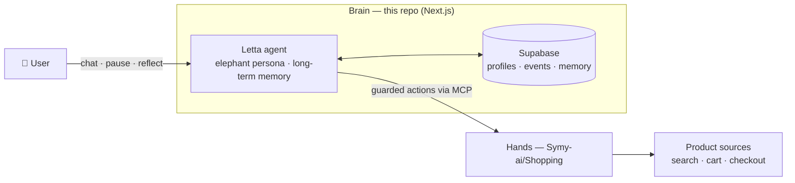

# Symy

**AI 绿色消费守护 — 少买一点，多活一点。Buy less. Live more.**

Symy is an open companion for sustainable consumption. Its elephant companion helps people pause, reflect, and turn engineered urges into choices that support a longer and freer life.

## Why Symy exists

Commerce today runs on attention algorithms. They predict what you will want, when you are tired or lonely, and which words will move you to check out — then they meet you at exactly that moment. The other side of that asymmetry deserves the same technology.

**Symy is not a shopping assistant.** A shopping assistant optimizes for the cart; Symy optimizes for your life. It is a guardian companion, and the one thing it is built to do well is to say **no** — gently, with reasons, and always on your side.

Two principles run through everything:

- **Never blame the user.** The manipulator is the growth machine, not the person. Symy frames every intercepted moment as a manipulation seen through, not a failure of willpower.
- **Pride and substance, both.** Every feature must give you something to be proud of (shareable green honor) *and* something you actually keep (real money and resources saved).

## Architecture: brain and hands

Symy follows a "brain and hands" architecture:

- **Brain** — this repository: a Next.js application whose personality companion is powered by [Letta](https://letta.com), with [Supabase](https://supabase.com) as the data and memory layer.
- **Hands** — the [Symy-ai/Shopping](https://github.com/Symy-ai/Shopping) MCP service, which performs the actual shopping actions (search, cart, checkout) against product sources — always under the brain's guard.



## Feature highlights

- **Interception funnel** — when an urge strikes, Symy walks the moment through a funnel: notice the emotional trigger, check the real need, then decide together whether it is *worth buying*, *can wait*, or *better skipped*.
- **Emotion guardian** — late-night doomscrolling and stress-spending moments are exactly when manipulation works best. The companion watches for emotional patterns and offers support instead of a checkout button.
- **Green alternatives** — before you buy new, Symy suggests reuse, second-hand, or fewer-and-better options, described qualitatively and honestly rather than with made-up carbon numbers.
- **Dream fund** — every purchase Symy helps you skip becomes visible progress toward a dream you named yourself. What you didn't spend is never gone; it is working for the life you actually want.
- **Guardian ranks** — a purely honor-based level system earned through guarded moments, green swaps, and streaks. Ranks measure behavior, never money, and the framework is built to honor, never to shame.
- **Weekly transparency report** — [`/transparency`](src/app/%5Blocale%5D/transparency) publishes the platform's aggregates in the open, refreshed weekly: intercepts, money saved for users, hours won back, CO₂ avoided, and the guardian count.
- **Financial transparency** — [`/transparency/finance`](src/app/%5Blocale%5D/transparency/finance) opens the monthly books: revenue and costs, members, and cost structure. Revenue comes from membership only — no ads, no data resale.
- **Growth in the open** — invites sent, completed, and unique inviters are published with the resulting K-factor, so growth is measured, not just claimed.
- **Report subscription** — one email a week when the report refreshes: numbers and methodology only, unsubscribe anytime, no marketing.
- **Inventory** — things you already own, mentioned in chat, are logged automatically ([`/api/inventory`](src/app/api/inventory)) and viewable in settings — a reuse-first record of what you have.

## Roadmap

Picked from our public backlog — contributions welcome on any of these:

1. **Own your data** — a self-serve export API so every user can take their data home at any time.
2. **Stronger hands authorization** — per-user authorization on top of the shared secret for the Shopping MCP service.
3. **Family members on real data** — move the family view from demo members to real, user-formed family groups.
4. **Sharper long-term memory** — embed new memories in real time so the companion recalls context instantly instead of in batches.
5. **Performance work** — memoization and message-list virtualization for long chat histories.

## Documentation

For deep reading:

- [`doc/PRODUCT-DOCTRINE.md`](doc/PRODUCT-DOCTRINE.md) — the product doctrine: green as the face, real savings as the substance, and the honor-not-shame standard every feature must pass.
- [`doc/symy-lab/`](doc/symy-lab/) — public design documents on Symy's governance philosophy, symbiotic AI, and the Dao behind the project (constitution, governance brief, symbiotic AI, dividend mechanism, Dao De Jing reading).
- [`doc/SAFETY-ENFORCED.md`](doc/SAFETY-ENFORCED.md) — how safety constraints are enforced in the product, not just promised.

## Quick start

```bash
git clone https://github.com/Symy-ai/Symy.git
cd Symy
npm install
cp .env.example .env.local
npm run dev
```

Fill the required variables in `.env.local` before using application features. See [CONTRIBUTING.md](CONTRIBUTING.md) for a walkthrough of the environment variables.

## Tests

```bash
npm run test
```

The snapshot baseline is 5,762 Vitest tests across 457 files.

## Contributing

Pull requests are welcome — this open-source repository lands every change through reviewed PRs. Read [CONTRIBUTING.md](CONTRIBUTING.md) for the development environment, test baseline, commit conventions, and PR process.

## License

Released under the [GNU Affero General Public License v3.0](LICENSE).
