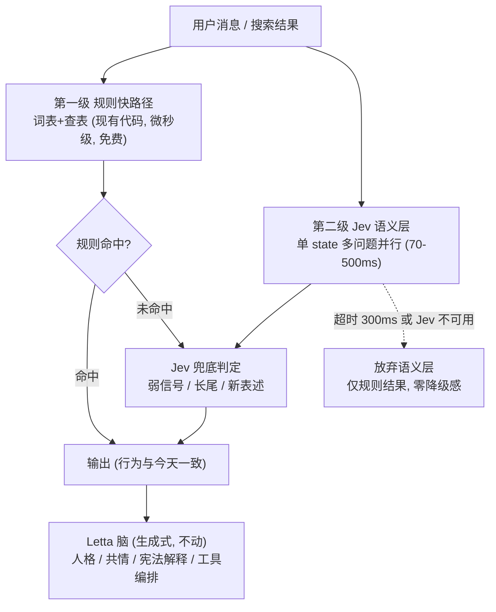
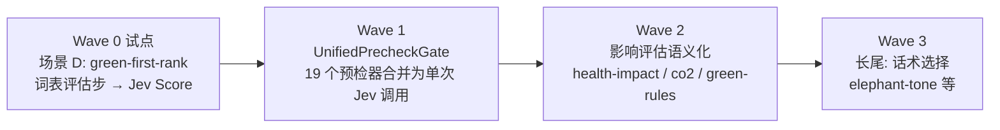

# Symy × Jev 引入方案 v2（拍板定案版）

> 2026-09-27 · 克莱尔 拟 · 本版记录 9/27 拍板结果与全量能力审计，取代 v1 决策稿。

---

## 0. 拍板记录（2026-09-27）

| 决策项 | 结论 |
|---|---|
| 方案形态 | **分层引入**（取代「全面转向」）——Jev 不进对话生成路径 |
| 试点 | **场景 D：搜索结果绿色重排**（green-first-rank 管道） |
| 迁移范围 | **除生成式 AI 能力外，全部能力转向 Jev**（本文档 §1 审计此指令的完整落地范围） |
| 文档落点 | 主仓库 `doc/`，作为架构文档序列一篇 |

**架构一句话：Letta 管说话（System 2，生成式），Jev 管判断（System 1，全部语义判定），规则管算术（确定性计算），嵌入保留现供应商（Jev 无此 API）。**

---

## 1. 全量能力审计（「其他能力」的完整清单）

对主仓库 1900 文件做了完整扫描。现状：**Brain 的全部语义判定 = 词库/正则/查表**，零模型参与；生成 = Letta（GLM-5.2 唯一路径）+ butterfly 特性；嵌入 = 智谱 embedding-3（RAG 管线）。

### 1.1 语义判定类 → 全部转 Jev（本次指令的主体）

**A. chat 预检器家族**（`src/app/api/chat/parts/`，发 Letta 前对用户消息做词库扫描，33 个 detector 相关文件）：

| # | 检测器 | 职责 | 现状痛点 |
|---|---|---|---|
| 1 | green-alt-detect | 非绿替代拦截→推荐预检 | 词库命中，长尾表述漏 |
| 2 | reuse-detect | 复用提示（先看看已有的） | 类目词表 |
| 3 | micro-challenge-detector | 微挑战卡提案 | 购买意图词+品类表 |
| 4 | emotion-shopping-detector | 情绪购物信号 | 情绪词表 |
| 5 | guard-pulse-detector | 守护脉搏问答意图 | 模式匹配 |
| 6 | impulse-forecast-detector | 预报问答意图 | 模式匹配 |
| 7 | impulse-time-query-detector | 时间查询意图 | 模式匹配 |
| 8 | list-triage-detector | 清单分诊 | 词表 |
| 9 | reflection-detector | 反思意图 | 词表 |
| 10 | savings-query-detector | 存款问答意图 | 模式匹配 |
| 11 | category-query-detector | 品类查询意图 | 模式匹配 |
| 12 | duplicate-purchase-detect | 重复购买检测 | 词表 |
| 13 | prepurchase-detect | 购前检测 | 词表 |
| 14 | follow-up-query | 追问意图 | 模式匹配 |
| 15 | pushback-detector | 拦截后反驳意图（「我就要买」） | 中英词表 |
| 16 | shopping-clarify | 购物澄清 | 词表 |
| 17 | green-knowledge-query | 绿色知识问答意图（三层匹配） | 词条库匹配 |
| 18 | alt-footprint-intent | 替代足迹召回意图 | 模式匹配 |
| 19 | shopping-context-signals | **弱信号词表**（「想奖励自己」「直播间最后三单」） | 手工扩词表，维护成本最高 |

**B. lib 级判定模块**（`src/lib/`）：

| # | 模块 | 职责 | 行数 |
|---|---|---|---|
| 20 | intent-detection | 意图+挑战结果分类（正则 EN+ZH） | 478 |
| 21 | bnpl-detector | BNPL 营销模式检测 | ~100 |
| 22 | health-impact | 健康影响分级（规则映射） | 384 |
| 23 | co2-estimate | 碳排放估算（查表） | 33 |
| 24 | green-rules + green-level | 绿色词表评估（**场景 D 试点落点**） | 225 |
| 25 | guard-category-insight | 品类洞察分类 | ~100 |
| 26 | green-first-rank / green-sort | 绿色优先重排管道（**场景 D**） | 52+22 |

### 1.2 生成式 → 留 Letta（拍板划定的边界）

- **Letta 对话**：人格、共情、宪法解释、工具编排——GLM-5.2 唯一路径，一字不动
- **butterfly 特性**：故事章节 + 插画引擎（`llm-client` 的真实消费方）——生成式，不动
- **Letta 记忆叙述化**：facts 写入记忆的表达——不动

### 1.3 嵌入/向量 → 技术上不可转（如实保留）

Jev 的 API 只有三种输出（是非概率/选项分布/量表评分），**没有嵌入接口**。以下保留智谱 embedding-3：

- `embeddings.ts` → `rag.ts`（pgvector 检索用户历史）→ `embed-backfill.ts`
- Letta 内部记忆 embedding（`openai/text-embedding-3-small`，Letta 自管）

### 1.4 确定性计算 → 留代码（转 Jev 是负收益）

统计、聚合、排序、预算、日历逻辑——算得出精确值的问题不问模型：

- impulse-forecast（8 周同星期统计）、guard-pulse（小时聚合）、报表家族（monthly-statement / weekly-compare / year-review）
- 时间窗（impulse-window / night-window）、spending-cap 追踪、游戏化账本（cultivation / challenge-store / badge）
- green-sort 稳定排序（装饰-排序-还原，纯算术）
- **例外**：co2-estimate / health-impact 的查表映射属知识编码非算术——转 Jev 语义评分（Wave 2），算术部分不动

### 1.5 基础设施 → 不动

Letta 管理层（agent-manager/pool/admin）、MCP 桥（Hands 通信）、ai-audit、reasoning-leak-guard（P0 信任兜底，保持确定性正则）、限流/锁/监控。

---

## 2. 目标架构：两级门（不是删规则）



**为什么是两级门而不是全换**：

1. **Jev 是 early access + waitlist + 单一供应商**——规则层是永远在线的降级路径
2. **规则层是行为基准**——每个 wave 的 evals 以它为对照（Shopping 重写同款纪律）
3. **延迟零增加**——规则路径先行（μs 级），Jev 层并行跑、300ms 预算超时即放弃；语义增强是 bonus 不是依赖
4. **词表维护成本归零是最大收益**——shopping-context-signals 的手工扩词表痛点直接消失，中英双语泛化免费获得

**预检器合并的技术甜点**：Jev API 设计就是「单 state 塞尽可能多的问题、全部并行评估」。19 个 parts/ 检测器 → **一次 Jev 调用**（一条消息 = 一个 state，19 个 Noul 问题打包）。SSE 事件结构不变，前端零改动。

---

## 3. 迁移波次



| Wave | 范围 | 为什么这个顺序 |
|---|---|---|
| **0（试点）** | 场景 D：green-first-rank 的词表评估步 → Jev Score | 翻车半径最小——只影响结果卡排序，不碰「是否拦截」类守护决策；unknown 档天然兜底 |
| **1** | UnifiedPrecheckGate：19 个预检器 → 单次 Jev 调用 | 价值最高（弱信号泛化）但涉及守护决策，evals 门槛高；试点经验复用 |
| **2** | health-impact / co2-estimate / green-rules 长尾兜底 | 影响评估的泛化（新品类、描述模糊商品） |
| **3** | elephant-tone 话术选择等长尾 | 低价值，有空再做 |

**Wave 0 验收线（Shopping 重写同款纪律）**：

1. 冻结行为基准：现有 green-rules 词表在标注集上的三档分类输出
2. 标注集：symy_search 结果样本 × 人工绿色评分（目标 ≥200 条，中英各半）
3. 通过线：Jev vs 词表——三档一致率 ≥90%，且长尾（词表 unknown 的）给出合理分辨
4. 校准审计：Noul/Score 置信度 vs 实际命中率可靠性曲线（防 Cupertino 偏见）

---

## 4. DecisionGate 契约（接口草稿）

```typescript
// 所有语义判定的统一出口 — 供应商可替换（Jev / LLM wrapper / 未来复刻）
interface DecisionGate {
  evaluate(state: GateState, questions: GateQuestion[]): Promise<GateResult[]>;
  readonly provider: 'jev' | 'llm-wrapper' | 'rules';
}

type GateQuestion =
  | { kind: 'noul'; id: string; statement: string }          // 是非 → [0,1]
  | { kind: 'choice'; id: string; options: string[] }        // 选择 → 分布
  | { kind: 'score'; id: string; levels: LevelDesc[] };      // 量表 → 浮点

interface GateResult {
  id: string;
  kind: GateQuestion['kind'];
  confidence: number;        // Jev: 校准置信度; wrapper: 自估
  value: number | number[];  // 按问题类型
  latencyMs: number;
}
```

- **Phase 0（waitlist 期间）**：`LLMWrapperGate` 实现（GLM-4o-mini 走 llm-client 通道，模拟 Noul/Choice/Score 输出）——全链路程序分支先跑通，拿到 Jev 访问后只换实现类
- **降级链**：Jev 超时/报错 → 自动落回规则层（第一级本来就在），无需额外逻辑

---

## 5. 风险与对冲（继承 v1 + 全量版新增）

| 风险 | 对冲 |
|---|---|
| Jev 是 early access + waitlist，何时可用不确定 | LLMWrapperGate 先行跑通契约；拿到访问只换实现 |
| 单一供应商锁定 | DecisionGate 抽象；开源复刻（Kev 等）已在出现 |
| 速度/成本收益有水分（193x/444x 是官方高端值） | 不押速度收益，押语义泛化；性能用自己的 evals 实测 |
| 校准声称未经独立验证（湾区城市偏见实验） | Wave 0 校准审计是验收线之一 |
| 预检器加延迟 | 两级门：规则先行 + Jev 并行 + 300ms 超时放弃 |
| Jev 故障 | 规则层永远在线（本来就是第一级） |
| 守护决策误判（拦错/漏拦） | Wave 1 前必须过 Wave 0 验收线；每 wave 灰度 + 可回退开关 |

---

## 6. Phase 0 行动清单（本周）

| # | 事项 | 负责 |
|---|---|---|
| 1 | 申请 Jev waitlist（typesafe.ai，建议用 Symy 官方邮箱） | Spark |
| 2 | `DecisionGate` 接口 + `LLMWrapperGate` 实现进主仓库（含单测） | 克莱尔 |
| 3 | 场景 D 标注集：symy_search 结果 × 绿色评分 ≥200 条 | 克莱尔（Spark 抽检） |
| 4 | 本文档推 `doc/`（本条已完成即本文档所在） | 克莱尔 |

---

## 附：与 v1 的差异

- v1 是决策稿（三问待拍板）；v2 记录拍板结果并落地「除生成式外全量转向」的完整审计
- v1 四场景（A 反诱导 / B 环境评分 / C 冲动信号 / D 重排）映射到全量波次：D=W0，A+C=W1（预检器家族），B=W2
- 新增：两级门架构（应对全量范围的降级与延迟问题）、预检器合并设计（19→1）、DecisionGate 契约草稿
